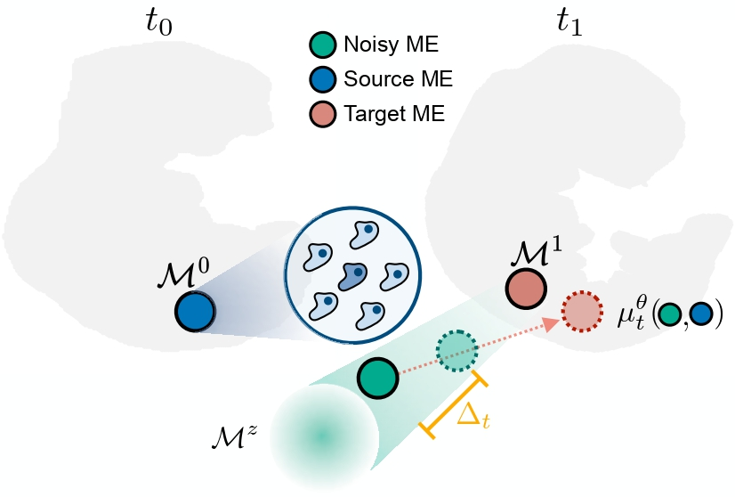

# Modeling Microenvironment Trajectories on Spatial Transcriptomics with NicheFlow
<p align="center">
  <b>Kristiyan Sakalyan*</b>, <b>Alessandro Palma*</b>, <b>Filippo Guerranti*</b>, Fabian J. Theis, Stephan Günnemann
</p>
<p align="center">
    <a href="https://www.cs.cit.tum.de/daml/nicheflow/">Project page</a> | 
    <a href="https://openreview.net/forum?id=5ofJyjgrth">OpenReview </a>
    <!-- <a href="#">arXiv </a> -->

</p>
<p align="center"></p>

This repository provides the official implementation of **[NicheFlow](https://www.cs.cit.tum.de/daml/nicheflow)**

NicheFlow is a **flow-based generative model** designed to learn and predict the **spatiotemporal dynamics of cellular microenvironments** in time-resolved spatial transcriptomics.  

## Installation

We use [Poetry](https://python-poetry.org/) for dependency management. If you do not have Poetry installed, please follow the [installation instructions](https://python-poetry.org/docs/).

```bash
# Install dependencies
poetry install

# Activate the virtual environment
source .venv/bin/activate
```

## Data
We provide all the preprocessed datasets used in the paper on [FigShare](https://figshare.com/articles/software/NicheFlow_-_Data_Checkpoints_and_Results/30426610). 

After downloading, place the decompressed data in the [`data/`](data) folder.

## How to train
To train a model, you will also need the **classifier checkpoints** (used for evaluation), available on [FigShare](https://figshare.com/articles/software/NicheFlow_-_Data_Checkpoints_and_Results/30426610) in `main_ckpts.zip`.

After downloading, place them in the [`checkpoints/`](ckpts) folder.

Then launch a training with:
```
python nicheflow/train.py experiment=...
```

For example, to train **NicheFlow** with the **GLVFM objective** on the **mouse embryonic development** (MED) dataset:
```
python nicheflow/train.py experiment=nicheflow/glvfm/med
```

All experiment configurations are stored in the [`configs/experiment/`](configs/experiment/) folder.

**Note:** If you encounter any path-related errors, ensure that:
- The root paths [`configs/paths/default.yaml`](configs/paths/default.yaml) reflect your local setup.
- The classifier checkpoint and dataset paths are correctly set in each [`configs/data/{model_name}_{dataset_name}.yaml`](configs/data/) file.

## Adding new datasets

To train on additional datasets, follow the guidelines provided in [NEW_DATASETS.md](NEW_DATASETS.md)

## Reproducibility

Detailed instructions to reproduce all experiments and tables from the paper are available in [REPRODUCIBILITY.md](REPRODUCIBILITY.md).

## Citation
If you use this work, please cite our paper as follows.
```
@inproceedings{sakalayan2025nicheflow,
    title={Modeling Microenvironment Trajectories on Spatial Transcriptomics with NicheFlow},
    author={Sakalayan, Kristiyan and Palma, Alessandro and Guerranti, Filippo and Theis, Fabian and G{\"u}nnemann, Stephan},
    booktitle={Neural Information Processing Systems (NeurIPS)},
    year={2025},
    url={https://openreview.net/forum?id=5ofJyjgrth}
}
```